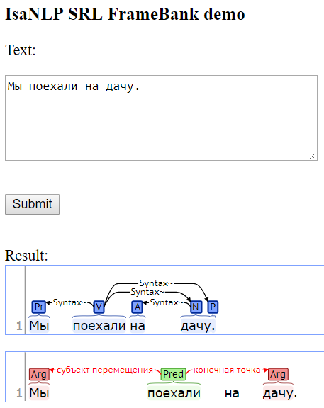

[](https://github.com/IINemo/isanlp_srl_framebank/blob/master/LICENSE)


# IsaNLP SRL FrameBank 
This Python 3 library provides SRL parser for Russian based on neural network models trained on [FrameBank](https://github.com/olesar/framebank) corpus -- semantically annotated corpus of texts in Russian. The parser should be used in conjunction with [IsaNLP library](https://github.com/IINemo/isanlp) and can be considered its module.  
__Disclaimer:__ the code is in alpha stage. 

## Installation
Note: the library is considered for Python 3.6. If you do not have one, checkout [pyenv](https://github.com/pyenv/pyenv) or [this](https://hub.docker.com/r/windj007/jupyter-keras-tools/) docker container powered with the data science tools: jupyter, keras, sklearn, gensim, tensorflow, pytorch, etc.

### Quick (few dependencies for usage with docker)
1. Install IsaNLP and its dependencies:
```
pip install grpcio
pip install git+https://github.com/IINemo/isanlp.git
```  
2. Install IsaNLP SRL FrameBank library:
```
pip install git+https://github.com/IINemo/isanlp_srl_framebank.git
```  

### Full
1. Do the same steps for Quick installation.
2. Install gensim, tensorflow, numpy, sklearn:
```
pip install gensim==3.6.0 smart-open==1.7.0 tensorflow==1.12.0 numpy sklearn
```  
3. Load the neural models from Git LFS
```
curl -s https://packagecloud.io/install/repositories/github/git-lfs/script.deb.sh | sudo bash
sudo apt-get install git-lfs
git lfs install
git-lfs pull
```

## Quick start with docker (< 10 mins)
1. Deploy docker containers for morphology, syntax, and SRL parsing:  
```
docker run --rm -p 3333:3333 inemo/isanlp
docker run --rm --shm-size=1024m -ti -p 3334:9999 inemo/syntaxnet_rus server 0.0.0.0 9999
docker run --rm -p 3335:3333 inemo/isanlp_srl_framebank
```  
2. Connect from python using `PipelineDefault`:  
```python  
#
from isanlp_srl_framebank.pipeline_default import PipelineDefault  
#
ppl = PipelineDefault(address_morph=('localhost', 3333),
                      address_syntax=('localhost', 3334),
                      address_srl=('localhost', 3335))
res = ppl('Мы поехали на дачу.')
#
```   
4. The `res` variable should contain all annotations including SRL annotations stored in `res['srl']`:
```
{'text': 'Мы поехали на дачу.',
 'tokens': [<isanlp.annotation.Token at 0x7f2290211240>,
  <isanlp.annotation.Token at 0x7f22902112e8>,
  <isanlp.annotation.Token at 0x7f2290211320>,
  <isanlp.annotation.Token at 0x7f22902113c8>,
  <isanlp.annotation.Token at 0x7f2290211438>],
 'sentences': [<isanlp.annotation.Sentence at 0x7f2290211470>],
 'mystem_postag': [['SPRO,мн,1-л=им',
   'V,сов,нп=прош,мн,изъяв',
   'PR=',
   'S,жен,неод=вин,ед',
   '']],
 'lemma': [['мы', 'поехать', 'на', 'дача', '.']],
 'morph': [[{'fPOS': 'PRON', 'Number': 'Plur', 'Person': '1', 'Case': 'Nom'},
   {'fPOS': 'VERB',
    'Aspect': 'Perf',
    'Valency': 'INTR',
    'Tense': 'Past',
    'Number': 'Plur',
    'VerbForm': 'Fin'},
   {'fPOS': 'ADP'},
   {'fPOS': 'NOUN',
    'Gender': 'Fem',
    'Animacy': 'Inan',
    'Case': 'Acc',
    'Number': 'Sing'},
   {}]],
 'postag': [['PRON', 'VERB', 'ADP', 'NOUN', '']],
 'syntax_dep_tree': [[<isanlp.annotation.WordSynt at 0x7f2290211630>,
   <isanlp.annotation.WordSynt at 0x7f2290211668>,
   <isanlp.annotation.WordSynt at 0x7f22902116d8>,
   <isanlp.annotation.WordSynt at 0x7f2290211710>,
   <isanlp.annotation.WordSynt at 0x7f2290211748>]],
 'srl': [[<isanlp.annotation.Event at 0x7f229021f278>]]}
```  
5. The variable `res['srl']` can be visualized as:  


## Package overview  
1. The semantic role labeler. The SRL parser is implemented in `ProcessorSrlFramebank` class. Path: `src/isanlp_srl_framebank/processor_srl_framebank.py`.
2. Trained neural network models for SRL parser: model for "known" predicates and model for "unknown" predicates. Path: `models`.
3. Docker container [inemo/isanlp_srl_framebank](https://hub.docker.com/r/inemo/isanlp_srl_framebank/) that contains preinstalled libraries and models. The container provides gRPC service for SRL parsing. Path: `docker/parser`. The container can be obtained with the command:  
`docker run --rm -p 3335:3333 inemo/isanlp_srl_framebank`
4. Dockerized web demo for visualization of SRL annotations via [brat](http://brat.nlplab.org/) annotation tool: [inemo/isanlp_srl_framebank_demo](https://hub.docker.com/r/inemo/isanlp_srl_framebank_demo/). Path: `docker/demo`. For example, the container can be obtained with the command (note, you need NLP services started on the corresponding ports, see [Quick start](#quick-start-with-docker) section):  
`docker run --rm -p 1111:80 -e IP_ADDRESS=10.0.0.9 -e MORPH_PORT=3333 -e SYNTAX_PORT=3334 -e SEM_PORT=3335  inemo/isanlp_srl_framebank_demo`  

## Usage 
### Parsing  
For version of parsing with less code (using docker) see [Quick start](#quick-start-with-docker) section.  
The processor for parsing is implemented in `ProcessorSrlFramebank` class. 
```python
from isanlp_srl_framebank.processor_srl_framebank import ProcessorSrlFramebank
```  
The object should be initialized by a path to models and dictionaries of the parser. Example:
```python
srl_proc = ProcessorSrlFramebank(model_dir_path = '~/srl_model_path')
```
The `model_dir_path` should contain:
  * embeddings.vec -- a model of word embeddings that can be loaded with `gensim.models.word2vec.KeyedVectors.load_word2vec_format` function.
  * known_preds.json -- the list of "known" predicates serialized into JSON. These predicates would be processed by the model for "known" predicates.
  * known_predicates -- (mandatory) directory with model files for "known" predicates.
  * unknown_predicates -- (optional) directory with model files for "unknown" predicates.
  * The directory with model files must contain:
    * feature_encoder.pckl -- pickled `sklearn.preprocessing.DictVectorizer` object that was used for categorical feature conversion during training.
    * label_encoder.pckl -- pickled `sklearn.preprocessing.LabelBinarizer` object that was used to encode labels into vectors during training.
    * feature_model.pckl -- pickled object that was used for extraction of features from linguistic annotations during training. The object should have `extract_features` member function.
    * neural_model.h5 -- saved keras model (with structure and weights).  

After initialization the object is ready for parsing using `__call__` function:  
```python  
  res = srl_proc(tokens, postag, morph, lemma, syntax_dep_tree)
```  
The input arguments are:
   * tokens -- a list of tokens.
   * postag -- a list of lists of postags in Universal Dependencies format (the first list means sentences, the second list means words in the sentence).
   * morph -- a list of lists of morphological features in Universal Dependencies format.
   * lemma -- a list of lists of lemmas.
   * syntax_dep_tree -- a list of syntax dependency trees of sentences in Universal Dependecies format.  
   
The proper annotations can be obtained by other components of IsaNLP library. Example:
```python
from isanlp.processor_remote import ProcessorRemote
from isanlp.ru.converter_mystem_to_ud import ConverterMystemToUd
from isanlp import PipelineCommon
# - To start morphology processor:
#$ docker run -d --rm -p 3333:3333 inemo/isanlp
# - To start ProcessorSyntaxNetRemote:
#$ docker run --shm-size=1024m -ti --rm -p 3334:9999 inemo/syntaxnet_rus server 0.0.0.0 9999
syntax_ppl = PipelineCommon([(ProcessorRemote('10.0.0.9', 3333, 'default'), 
                              ['text'], 
                              {'sentences' : 'sentences', 
                               'tokens' : 'tokens',
                               'postag' : 'mystem_postags',
                               'lemma' : 'lemma'}),
                              (ProcessorSyntaxNetRemote('10.0.0.9', 3334), 
                               ['tokens', 'sentences'], 
                               {'syntax_dep_tree' : 'syntax_dep_tree', 
                                'morph' : 'morph_syntaxnet'}),
                              (ConverterMystemToUd(), 
                               ['mystem_postags'], 
                               {'morph' : 'morph',
                                'postag' : 'postag'})])
#
annots = syntax_ppl('Мама мыла раму.')
annots = srl_proc(annots['postag'],   
                  annots['morph'], 
                  annots['lemma'], 
                  annots['syntax_dep_tree'])
```  
Finally, you get the SRL annotations:
```python
print(annots['srl'])
```  
```
[[<isanlp.annotation.Event at 0x7f229021f978>]]
```  

### SRL data structures
The results of SRL parser are stored in a list of lists of `isanlp.annotation.Event` objects. The first list corresponds to sentences, the second list corresponds to annotations inside a sentence.
Event objects have two members:
  * pred(tuple): predicate address -- tuple of begin end positions in sentence.
  * args(list): list of arguments -- tuples of `isanlp.annotation.TaggedSpan` objects. 
    Each tagged span contains: 
    * begin(int) -- starting position (in tokens in a sentence) of the argument in a sentence.
    * end(int) -- ending position of an argument in a sentence.
    * tag(string) -- semantic role.  

With lemma annotations it is possible to print roles like this:  
```python
def print_roles(lemma, role_annot):
    for sent_num, ann_sent in enumerate(role_annot):
        for event in ann_sent:
            print('=====Pred: {}'.format(lemma[sent_num][event.pred[0]]))
            for arg in event.args:
                print('Arg({}): {}'.format(arg.tag, lemma[sent_num][arg.begin]))
```  

Example:  
```python
print_roles(annots['lemma'], annots['srl'])
``` 
The result for `'Дети убежали из дома и заблудились в лесу.'`:
```
=====Pred: убегать
Arg(агенс): ребенок
Arg(начальная точка): дом
=====Pred: заблудиться
Arg(место): лес
```  

### Model training  
1. Download and preprocess dataset. 
```python ./run_download_preproc.py --workdir=<existing_workdir>```

2. Do the linguistic preprocessing of the dataset (postagging, parsing, etc.)

  * Start linguistic preprocessing services:
```
docker run --rm -d -p 3333:3333 inemo/isanlp
docker run --rm -d -p 3334:3333 inemo/isanlp_udpipe
```

  * Run preprocessing (change 192.168.1.69 to address of the machine, on which you started the linguistic processing services).
```python ./run_ling_parse.py --workdir=existing_workdir --isanlp_proc=192.168.1.69:3333 --udpipe_proc=192.168.1.69:3334```

3. Generate features, embed with ELMo, and train models:
```python ./run_training_pipeline.py --data_dir=existing_workdir --workdir=existing_workdir```


Finally you can take trained models from directories 'known_preds' and 'unknown_preds' and place them in \<project root\>/models directory to create updated docker containers (or use them in the processor).

### Starting web demo
1. To start web demo, you should start NLP services for morphology, syntax, and SRL parsing first:
```
docker run --rm -p 3333:3333 inemo/isanlp
docker run --rm --shm-size=1024m -ti -p 3334:9999 inemo/syntaxnet_rus server 0.0.0.0 9999
docker run --rm -p 3335:3333 inemo/isanlp_srl_framebank
```  
2. Start demo web application by the following command:
```
docker run --rm -d -p 1111:80 -e IP_ADDRESS=10.0.0.9 -e MORPH_PORT=3333 -e SYNTAX_PORT=8111 -e SEM_PORT=3334  inemo/isanlp_srl_framebank_demo
```  
Note: instead of `10.0.0.9` you should use your host ip address (but not localhost or 127.0.0.1).  
3. After web server started you can acesses demo interface at http://10.0.0.9:1111/demo/wui.py



## Compatability
The library should be compatible at least with Python 3.7.  
Tested with gensim==3.6.0 tensorflow==1.15.0 .

## Cite / Reference 
1. Models were published in [RANLP proceedings](http://lml.bas.bg/ranlp2019/proceedings-ranlp-2019.pdf) 
  * GOST: Larionov D., Shelmanov A., Chistova E., Smirnov I. Semantic role labeling with pretrained language models for known and unknown predicates // Proceedings of RANLP. — 2019. — P. 245–256.
  * BibTex:
```
@INPROCEEDINGS{devshelm2019ranlp,
      author = {Larionov D., Shelmanov A., Chistova E., Smirnov I.},
      title = {Semantic role labeling with pretrained language models for known and unknown predicates},
      booktitle = {Proceedings of Recent Advances in Natural Language Processing},
      year = {2019},
      pages = {620--628}
}
```

2. Original models for SRL were published in [Dialog proceedings](http://www.dialog-21.ru/media/3945/shelmanovaodevyatkinda.pdf).  
  * GOST:  
Shelmanov A., Devyatkin D. Semantic role labeling with neural networks for texts in Russian // Computational Linguistics and Intellectual Technologies. Papers from the Annual International Conference "Dialogue" (2017). — Vol. 1. — 2017. — P. 245–256.  
  * BibTex:
```  
@INPROCEEDINGS{devshelm2017dialog,
      author = {Shelmanov, A.O. and Devyatkin, D.A.},
      title = {Semantic role labeling with neural networks for texts in {Russian}},
      booktitle = {Computational Linguistics and Intellectual Technologies. Papers from the Annual International Conference "Dialogue" (2017)},
      year = {2017},
      volume={1},
      number = {16},
      pages = {245--256}
}
```  